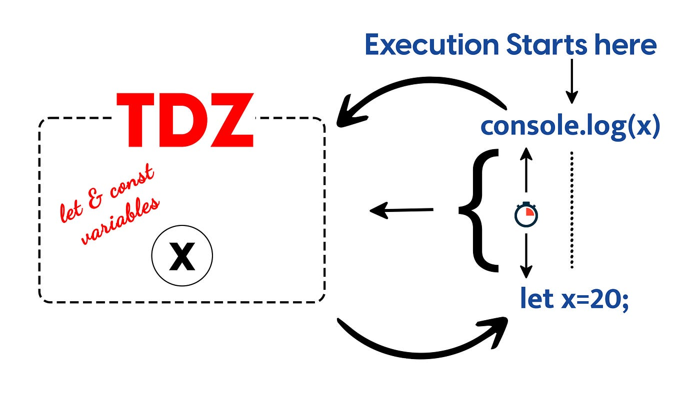

# JavaScript

## TDZ

Temporal dead zone TDZ или временная мертвая зона — это период времени между началом блока (например, блока {}) и моментом объявления переменной с помощью `let` или `const`. В это время переменная уже существует, но к ней нельзя обращаться, аопытка доступа вызовет ошибку.

TDZ существует только для переменных, объявленных с помощью `let` и `const`. У переменных, объявленных с помощью `var` TDZ нет.

### Почему возникает TDZ?

В JavaScript переменные, объявленные с помощью `let` и `const`, поднимаются (`hoisting`), но не инициализируются до момента их объявления.

Это сделано для того, чтобы предотвратить использование переменных до их объявления, что помогает избежать ошибок.

Здесь переменная `x` находится в TDZ до строки `let x = 10;`. Попытка доступа к `x` до её объявления вызывает ошибку:

```
console.log(x); // Выведет ошибку: Cannot access 'x' before initialization
let x = 10;
```



Пример TDZ в блоке `{}`. Переменная `y` находится в TDZ до строки `let y = 20;`. После объявления `y` становится доступной:

```
if (isSomething) {
    console.log(y); // Выведет ошибку: Cannot access 'y' before initialization
    let y = 20;
    console.log(y); // Выведет 20
}
```

Аналогично у переменных, объявленных с помощью `const`. Переменная `z` также находится в TDZ до её объявления. После объявления `z` становится доступной:

```
if (isSomething) {
    console.log(z); // Выведет ошибку: Cannot access 'z' before initialization
    const z = 30;
    console.log(z); // Выведет 30
}
```


TDZ и функции: переменная `a` находится в TDZ до строки `let a = 40;`. После объявления `a` становится доступной:

```
function doSomething() {
    console.log(a); // Выведет ошибку: Cannot access 'a' before initialization
    let a = 40;
    console.log(a); // Выведет 40
}

doSomething();
```


TDZ и циклы: переменная `i` объявлена с помощью `let`, поэтому она существует только внутри цикла. После завершения цикла i недоступна:

```
for (let i = 0; i < 3; i++) {
    console.log(i); // 0, 1, 2
}
console.log(i); // Выведет ошибку: i is not defined
```

Разница между `var`, `let` и `const`: `var` поднимается и инициализируется как `undefined`, тем временем `let` и `const` поднимаются, но остаются в TDZ до объявления:

```
console.log(a); // Выведет undefined (var поднята и инициализирована как undefined)
var a = 10;

console.log(b); // Выведет ошибку: Cannot access 'b' before initialization
let b = 20;

console.log(c); // Выведет ошибку: Cannot access 'c' before initialization
const c = 30;
```

TDZ и классы: в JavaScript классы не поднимаются (hoisted) так же, как функции или переменные, объявленные через `var`. Это значит, что класс нельзя использовать до его объявления. Классы в JavaScript не поднимаются полностью. Они находятся в Temporal Dead Zone (TDZ) до момента их объявления.

```
new Car('red'); // Выдаст ошибку: can't access lexical declaration 'Car' before initialization

class Car {
  constructor(color) {
    this.color = color;
  }
}
```

Интерпретатор выполняет код сверху вниз. Когда он встречает `new Car('red')`, он ещё не знает, что такое `Car`. Чтобы код работал, нужно объявить класс до его использования:

```
class Car {
  constructor(color) {
    this.color = color;
  }
}

new Car('red'); // Ok
```

Почему классы не поднимаются? Это сделано для того, чтобы избежать ошибок и сделать код более предсказуемым. Если бы классы поднимались, как функции, это могло бы привести к путанице, особенно в больших проектах.

Это отличается от функций, объявленных через `function`, которые поднимаются полностью и могут быть вызваны до их объявления, поэтому такой код работает:

```
createCar('red'); // Ok

function createCar(color) {
  return { color };
}
```

```
console.log(greet('World')); // Выведет "World"

function greet(who) {
  return `Hello, ${who}!`;
}
```

### Почему TDZ полезен?

1. Предотвращение ошибок:

TDZ помогает избежать использования переменных до их объявления, что делает код более предсказуемым.

2. Улучшение читаемости:

Код становится легче читать, так как переменные используются только после их объявления.

3. Строгий режим:

TDZ является частью строгого режима JavaScript, который помогает писать более безопасный код.

## Источники

1. [Don't Use JavaScript Variables Without Knowing Temporal Dead Zone](https://dmitripavlutin.com/javascript-variables-and-temporal-dead-zone/)
